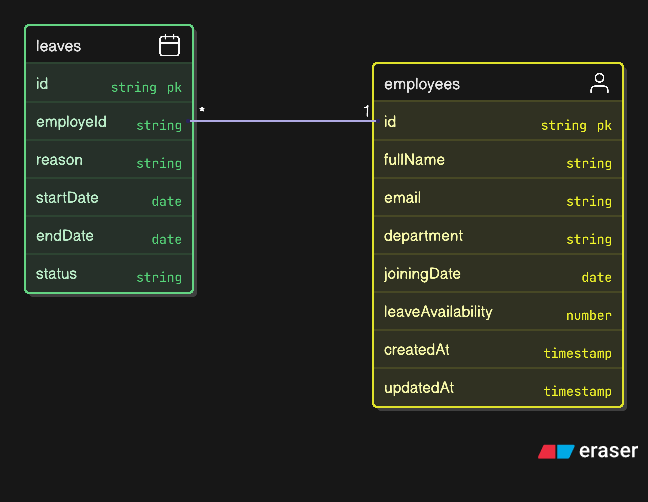

# Simple Leave Management System

A Node.js/Express.js RESTful API for managing employee leave requests with comprehensive validation, overlap detection, and leave balance management.

## Architecture


## Features

- ✅ Employee registration with validation
- ✅ Leave application with comprehensive validation
- ✅ Leave overlap detection (prevents duplicate requests)
- ✅ Leave balance management
- ✅ Leave approval/rejection by HR
- ✅ Paginated leave listings
- ✅ **Rate limiting middleware** (IP-based protection)
- ✅ Error handling middleware
- ✅ Security middleware (Helmet, CORS)
- ✅ TypeScript support
- ✅ MongoDB integration with Mongoose

## Tech Stack

- **Backend:** Node.js, Express.js
- **Language:** TypeScript
- **Database:** MongoDB with Mongoose ODM
- **Security:** Helmet, CORS, express-rate-limit
- **Authentication:** JWT (jsonwebtoken)
- **Password Hashing:** bcrypt
- **Development:** nodemon, ts-node

## Project Structure

```
simple-leave-management/
├── src/
│   ├── controllers/
│   │   ├── employee.controller.ts    # Employee management logic
│   │   └── leave.controller.ts       # Leave management logic
│   ├── middleware/
│   │   ├── errorHandler.middleware.ts # Global error handling
│   │   └── rateLimiter.middleware.ts  # Rate limiting configurations
│   ├── models/
│   │   ├── employee.model.ts         # Employee data schema
│   │   └── leave.model.ts            # Leave request schema
│   ├── routes/
│   │   ├── employee.routes.ts        # Employee API routes
│   │   └── leave.routes.ts           # Leave API routes
│   ├── utils/
│   │   └── asyncHandler.ts           # Async error wrapper
│   ├── app.ts                        # Express app configuration
│   └── server.ts                     # Server entry point
├── package.json
├── tsconfig.json
└── README.md
```

## Installation & Setup

1. **Clone the repository**
   ```bash
   git clone https://github.com/D3BAS1SH/simple-leave-management.git
   cd simple-leave-management
   ```

2. **Install dependencies**
   ```bash
   npm install
   ```

3. **Environment Configuration**
   
   Create a `.env` file in the root directory:
   ```env
   # MongoDB Configuration
   MONGODB_URI=mongodb://localhost:27017/leave-management
   
   # Server Configuration
   PORT=3000
   NODE_ENV=development
   
   # JWT Configuration (if implementing authentication)
   JWT_SECRET=your-super-secret-jwt-key
   JWT_EXPIRES_IN=7d
   ```

4. **Build the project**
   ```bash
   npm run build
   ```

5. **Start the server**
   
   **Development mode:**
   ```bash
   npm run dev
   ```
   
   **Production mode:**
   ```bash
   npm start
   ```

## API Endpoints

### Employee Management

#### Create Employee
- **POST** `/api/v1/employees/create`
- **Rate Limit:** 5 requests per 15 minutes (Strict)
- **Body:**
  ```json
  {
    "fullName": "John Doe",
    "email": "john.doe@company.com",
    "department": "Engineering",
    "joiningDate": "2024-01-15",
    "leaveAvailability": 40
  }
  ```
- **Response:** `201 Created`

### Leave Management

#### Apply for Leave
- **POST** `/api/v1/leaves/apply-leave`
- **Rate Limit:** 10 requests per 1 hour (Leave-specific)
- **Body:**
  ```json
  {
    "employeeId": "60d5ec49f1b2c8b1f8e4e1a0",
    "startDate": "2025-08-16",
    "endDate": "2025-08-29",
    "reason": "Family vacation"
  }
  ```
- **Response:** `201 Created`

#### Get All Leaves (HR)
- **GET** `/api/v1/leaves?page=1&limit=10`
- **Rate Limit:** 200 requests per 15 minutes (Read operations)
- **Response:** Paginated list of all leave requests

#### Get Pending Leaves (HR)
- **GET** `/api/v1/leaves/pending?page=1&limit=10`
- **Rate Limit:** 200 requests per 15 minutes (Read operations)
- **Response:** Paginated list of pending leave requests

#### Update Leave Status (HR)
- **PATCH** `/api/v1/leaves/:id`
- **Rate Limit:** 5 requests per 15 minutes (Strict)
- **Body:**
  ```json
  {
    "status": "Approved"
  }
  ```
- **Response:** `200 OK`

## Data Models

### Employee Schema
```typescript
{
  fullName: string,        // 3-30 chars, letters and spaces only
  email: string,           // Unique, valid email format
  department: string,      // Required
  joiningDate: Date,       // Required
  leaveAvailability: number, // Default: 40 days
  createdAt: Date,
  updatedAt: Date
}
```

### Leave Schema
```typescript
{
  employeId: ObjectId,     // Reference to Employee
  reason: string,          // Max 300 characters
  startDate: Date,         // Required
  endDate: Date,           // Required
  status: "Pending" | "Approved" | "Rejected", // Default: Pending
  createdAt: Date,
  updatedAt: Date
}
```

## Business Rules & Validations

### Leave Application Rules
1. **Date Validation:** Start date cannot be after end date
2. **Past Date Check:** Cannot apply for leave in the past
3. **Joining Date Check:** Cannot apply for leave before employee's joining date
4. **Overlap Detection:** Prevents overlapping leave requests (pending/approved)
5. **Leave Balance:** Ensures sufficient leave balance before approval
6. **Field Requirements:** All fields (employeeId, startDate, endDate, reason) are mandatory

### Leave Approval Rules
1. **Status Validation:** Only "Approved" or "Rejected" status allowed
2. **Pending Check:** Can only update pending leave requests
3. **Balance Deduction:** Automatically deducts leave days when approved
4. **Final Balance Check:** Verifies leave balance before final approval

## Error Handling

The API implements comprehensive error handling with:
- Input validation errors (400 Bad Request)
- Resource not found errors (404 Not Found)
- Conflict errors for duplicates (409 Conflict)
- Rate limiting errors (429 Too Many Requests)
- Server errors (500 Internal Server Error)
- Custom error messages for better debugging

## Rate Limiting Strategy

The application implements a multi-tier rate limiting approach:

### 1. **General Rate Limiter** (Global)
- **Limit:** 100 requests per 15 minutes per IP
- **Scope:** All API endpoints (except health checks)
- **Purpose:** Prevents general API abuse

### 2. **Read Operations Rate Limiter**
- **Limit:** 200 requests per 15 minutes per IP
- **Applied to:** GET endpoints (viewing leaves)
- **Purpose:** More lenient limits for data retrieval

### 3. **Leave Application Rate Limiter**
- **Limit:** 10 requests per 1 hour per IP
- **Applied to:** POST `/api/v1/leaves/apply-leave`
- **Purpose:** Prevents spam leave applications

### 4. **Strict Rate Limiter** (Sensitive Operations)
- **Limit:** 5 requests per 15 minutes per IP
- **Applied to:** 
  - Employee creation
  - Leave status updates (approve/reject)
- **Purpose:** Maximum protection for critical operations

### Rate Limit Headers
All rate-limited responses include standard headers:
- `RateLimit-Limit`: Request limit per time window
- `RateLimit-Remaining`: Requests remaining in current window
- `RateLimit-Reset`: Time when the current window resets

## Security Features

- **Helmet:** Security headers for protection against common vulnerabilities
- **CORS:** Cross-Origin Resource Sharing configuration
- **Rate Limiting:** IP-based request limiting with multiple tiers:
  - **General API:** 100 requests per 15 minutes
  - **Read Operations:** 200 requests per 15 minutes
  - **Leave Applications:** 10 requests per 1 hour
  - **Sensitive Operations:** 5 requests per 15 minutes
- **Input Validation:** Comprehensive validation for all inputs
- **Error Sanitization:** Prevents information leakage in error responses

## Development

### Available Scripts
- `npm run dev` - Start development server with auto-reload
- `npm run build` - Compile TypeScript to JavaScript
- `npm start` - Start production server

### Development Tools
- **TypeScript:** Type safety and modern JavaScript features
- **nodemon:** Auto-restart on file changes
- **ts-node:** Direct TypeScript execution
- **tsconfig-paths:** Path mapping support

## Contributing

1. Fork the repository
2. Create a feature branch (`git checkout -b feature/amazing-feature`)
3. Commit your changes (`git commit -m 'Add some amazing feature'`)
4. Push to the branch (`git push origin feature/amazing-feature`)
5. Open a Pull Request

## License

This project is licensed under the ISC License.

## Author

**D3BAS1SH**
- GitHub: [@D3BAS1SH](https://github.com/D3BAS1SH)

## ER Diagram



## Business Logic

### Employee Creation
- **Endpoint**: `POST /api/v1/employees/create`
- **Required Fields**:
  - `fullName` (string): Full name of the employee (3-30 characters, letters and spaces only).
  - `email` (string): Unique email address in a valid format.
  - `department` (string): Must be one of the predefined `Department` enum values.
  - `joiningDate` (date): The date the employee joined the company. **Cannot be in the past.**
  - `leaveAvailability` (integer, optional): Number of leave days available (default: 40).
- **Validation**:
  - Ensures all required fields are provided.
  - Validates `department` against the `Department` enum.
  - Throws an error if `leaveAvailability` is less than 1.

### Leave Application
- **Endpoint**: `POST /api/v1/leaves/apply-leave`
- **Required Fields**:
  - `employeeId` (string): The ID of the employee applying for leave.
  - `startDate` (date): The start date of the leave.
  - `endDate` (date): The end date of the leave.
  - `reason` (string): The reason for the leave.
- **Business Logic**:
  1. Validate input fields.
  2. Ensure `startDate` is not after `endDate`.
  3. Prevent applying for leave in the past.
  4. Check if the leave dates overlap with existing approved or pending leave requests.
  5. Verify the employee has sufficient leave balance.
  6. Reject the request if any validation fails.
- **Pseudocode**:
  ```
  if not all required fields:
      throw error "All fields are required"
  if startDate > endDate:
      throw error "Start date cannot be after end date"
  if startDate < today:
      throw error "Cannot apply for leave in the past"
  if overlapping leave exists:
      throw error "Leave request overlaps with an existing leave"
  if leave balance < required days:
      throw error "Insufficient leave balance"
  create leave request
  ```

### HR Leave Requests
- **Endpoint**: `GET /api/v1/leaves`
- **Features**:
  - Pagination: Supports `page` and `limit` query parameters.
  - Filtering: Allows filtering by `status` (`Pending`, `Approved`, `Rejected`).
- **Response**:
  - Paginated list of leave requests with employee details.

### HR Leave Approval/Rejection
- **Endpoint**: `PATCH /api/v1/leaves/:id`
- **Required Fields**:
  - `id` (string): The ID of the leave request.
  - `status` (string): Must be `Approved` or `Rejected`.
- **Business Logic**:
  1. Validate the `status` field.
  2. Ensure the leave request is in `Pending` status.
  3. If approving, check the employee's leave balance and deduct the required days.
  4. Update the leave request with the new status.
- **Pseudocode**:
  ```
  if status not in ["Approved", "Rejected"]:
      throw error "Invalid status"
  if leave request not found:
      throw error "Leave request not found"
  if leave status != "Pending":
      throw error "Leave request already processed"
  if status == "Approved":
      if leave balance < required days:
          throw error "Insufficient leave balance"
      deduct leave days from balance
  update leave request status
  ```

---

For more detailed API documentation, refer to the inline comments in the controller files:
- [Leave Controller Documentation](src/controllers/leave.controller.md)
- [Employee Controller](src/controllers/employee.controller.ts)
