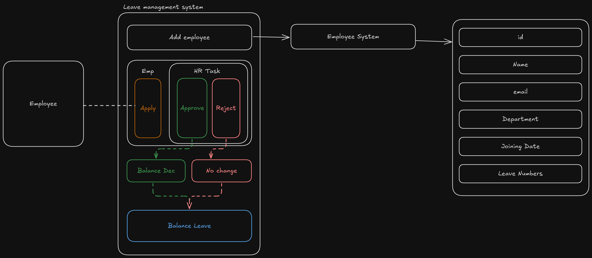

# Simple Leave Management System

A Node.js/Express.js RESTful API for managing employee leave requests with comprehensive validation, overlap detection, and leave balance management.

## Architecture



## Features

- ✅ Employee registration with validation
- ✅ Leave application with comprehensive validation
- ✅ Leave overlap detection (prevents duplicate requests)
- ✅ Leave balance management
- ✅ Leave approval/rejection by HR
- ✅ Paginated leave listings
- ✅ Error handling middleware
- ✅ Security middleware (Helmet, CORS)
- ✅ TypeScript support
- ✅ MongoDB integration with Mongoose

## Tech Stack

- **Backend:** Node.js, Express.js
- **Language:** TypeScript
- **Database:** MongoDB with Mongoose ODM
- **Security:** Helmet, CORS, express-rate-limit
- **Authentication:** JWT (jsonwebtoken)
- **Password Hashing:** bcrypt
- **Development:** nodemon, ts-node

## Project Structure

```
simple-leave-management/
├── src/
│   ├── controllers/
│   │   ├── employee.controller.ts    # Employee management logic
│   │   └── leave.controller.ts       # Leave management logic
│   ├── middleware/
│   │   └── errorHandler.middleware.ts # Global error handling
│   ├── models/
│   │   ├── employee.model.ts         # Employee data schema
│   │   └── leave.model.ts            # Leave request schema
│   ├── routes/
│   │   ├── employee.routes.ts        # Employee API routes
│   │   └── leave.routes.ts           # Leave API routes
│   ├── utils/
│   │   └── asyncHandler.ts           # Async error wrapper
│   ├── app.ts                        # Express app configuration
│   └── server.ts                     # Server entry point
├── package.json
├── tsconfig.json
└── README.md
```

## Installation & Setup

1. **Clone the repository**
   ```bash
   git clone https://github.com/D3BAS1SH/simple-leave-management.git
   cd simple-leave-management
   ```

2. **Install dependencies**
   ```bash
   npm install
   ```

3. **Environment Configuration**
   
   Create a `.env` file in the root directory:
   ```env
   # MongoDB Configuration
   MONGODB_URI=mongodb://localhost:27017/leave-management
   
   # Server Configuration
   PORT=3000
   NODE_ENV=development
   
   # JWT Configuration (if implementing authentication)
   JWT_SECRET=your-super-secret-jwt-key
   JWT_EXPIRES_IN=7d
   ```

4. **Build the project**
   ```bash
   npm run build
   ```

5. **Start the server**
   
   **Development mode:**
   ```bash
   npm run dev
   ```
   
   **Production mode:**
   ```bash
   npm start
   ```

## API Endpoints

### Employee Management

#### Create Employee
- **POST** `/api/v1/employees/create`
- **Body:**
  ```json
  {
    "fullName": "John Doe",
    "email": "john.doe@company.com",
    "department": "Engineering",
    "joiningDate": "2024-01-15",
    "leaveAvailability": 40
  }
  ```
- **Response:** `201 Created`

### Leave Management

#### Apply for Leave
- **POST** `/api/v1/leaves/apply-leave`
- **Body:**
  ```json
  {
    "employeeId": "60d5ec49f1b2c8b1f8e4e1a0",
    "startDate": "2025-08-16",
    "endDate": "2025-08-29",
    "reason": "Family vacation"
  }
  ```
- **Response:** `201 Created`

#### Get All Leaves (HR)
- **GET** `/api/v1/leaves?page=1&limit=10`
- **Response:** Paginated list of all leave requests

#### Get Pending Leaves (HR)
- **GET** `/api/v1/leaves/pending?page=1&limit=10`
- **Response:** Paginated list of pending leave requests

#### Update Leave Status (HR)
- **PATCH** `/api/v1/leaves/:id`
- **Body:**
  ```json
  {
    "status": "Approved"
  }
  ```
- **Response:** `200 OK`

## Data Models

### Employee Schema
```typescript
{
  fullName: string,        // 3-30 chars, letters and spaces only
  email: string,           // Unique, valid email format
  department: string,      // Required
  joiningDate: Date,       // Required
  leaveAvailability: number, // Default: 40 days
  createdAt: Date,
  updatedAt: Date
}
```

### Leave Schema
```typescript
{
  employeId: ObjectId,     // Reference to Employee
  reason: string,          // Max 300 characters
  startDate: Date,         // Required
  endDate: Date,           // Required
  status: "Pending" | "Approved" | "Rejected", // Default: Pending
  createdAt: Date,
  updatedAt: Date
}
```

## Business Rules & Validations

### Leave Application Rules
1. **Date Validation:** Start date cannot be after end date
2. **Past Date Check:** Cannot apply for leave in the past
3. **Joining Date Check:** Cannot apply for leave before employee's joining date
4. **Overlap Detection:** Prevents overlapping leave requests (pending/approved)
5. **Leave Balance:** Ensures sufficient leave balance before approval
6. **Field Requirements:** All fields (employeeId, startDate, endDate, reason) are mandatory

### Leave Approval Rules
1. **Status Validation:** Only "Approved" or "Rejected" status allowed
2. **Pending Check:** Can only update pending leave requests
3. **Balance Deduction:** Automatically deducts leave days when approved
4. **Final Balance Check:** Verifies leave balance before final approval

## Error Handling

The API implements comprehensive error handling with:
- Input validation errors (400 Bad Request)
- Resource not found errors (404 Not Found)
- Conflict errors for duplicates (409 Conflict)
- Server errors (500 Internal Server Error)
- Custom error messages for better debugging

## Security Features

- **Helmet:** Security headers for protection against common vulnerabilities
- **CORS:** Cross-Origin Resource Sharing configuration
- **Input Validation:** Comprehensive validation for all inputs
- **Error Sanitization:** Prevents information leakage in error responses

## Development

### Available Scripts
- `npm run dev` - Start development server with auto-reload
- `npm run build` - Compile TypeScript to JavaScript
- `npm start` - Start production server

### Development Tools
- **TypeScript:** Type safety and modern JavaScript features
- **nodemon:** Auto-restart on file changes
- **ts-node:** Direct TypeScript execution
- **tsconfig-paths:** Path mapping support

## Contributing

1. Fork the repository
2. Create a feature branch (`git checkout -b feature/amazing-feature`)
3. Commit your changes (`git commit -m 'Add some amazing feature'`)
4. Push to the branch (`git push origin feature/amazing-feature`)
5. Open a Pull Request

## License

This project is licensed under the ISC License.

## Author

**D3BAS1SH**
- GitHub: [@D3BAS1SH](https://github.com/D3BAS1SH)

---

For more detailed API documentation, refer to the inline comments in the controller files:
- [Leave Controller Documentation](src/controllers/leave.controller.md)
- [Employee Controller](src/controllers/employee.controller.ts)
